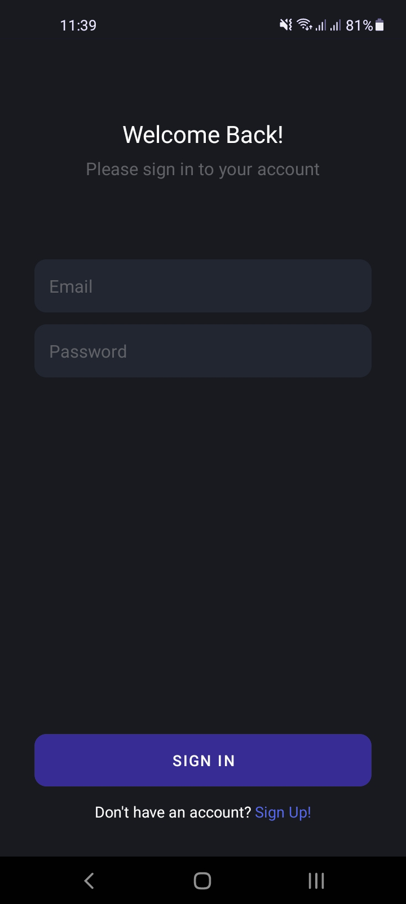
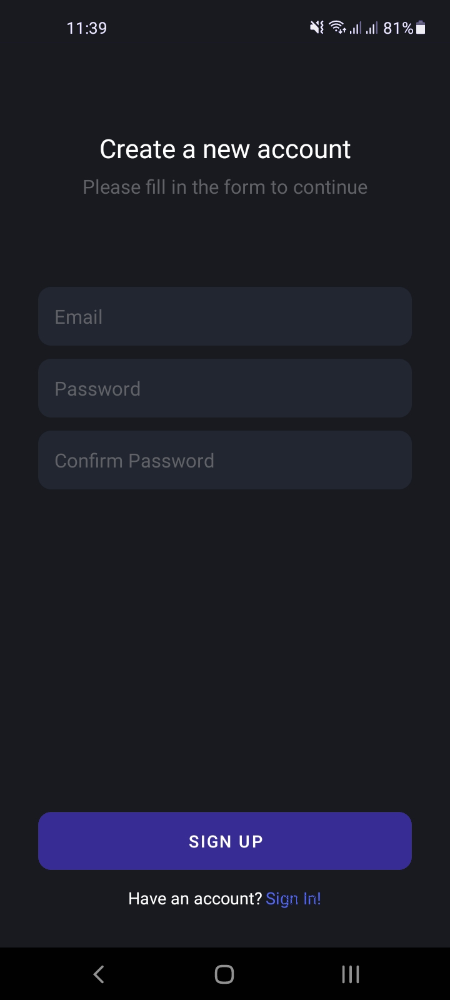
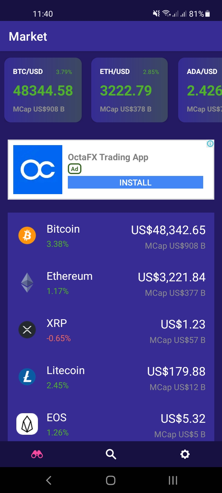
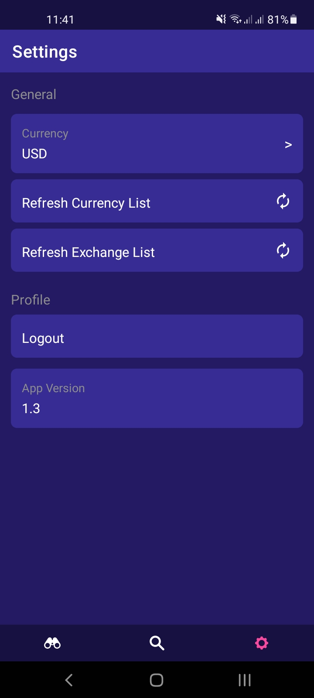
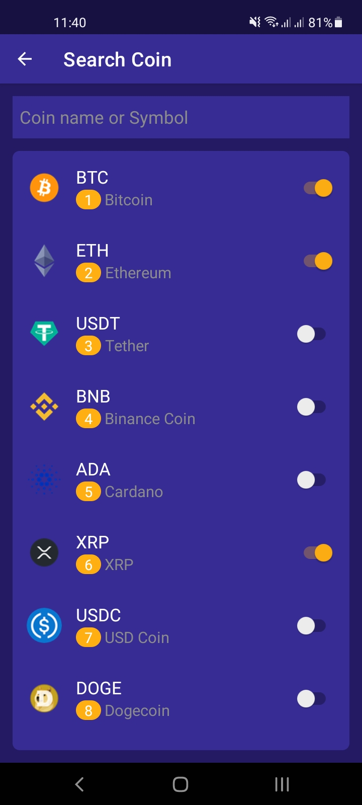

# CoinBit
Quoting the orignal developers, *"CoinBit is a beautiful CryptoCurrency app, completely open sourced and 100% in kotlin"*. The source code for the non-modified version of this application can be found [here](https://github.com/pranayairan/CoinBit).  

## Modifications

* Integration with Firebase authentication, and signup/login functionalities.
* Integration with [CryptoMarketCap](https://coinmarketcap.com/) APIs in order to arrange all lists of coins by market cap.
* Removing UI elements related to news and disclaimers in settings and main page. 
* Fixing bugs in the orignal application which led to crashes as well as the UI not behaving as it should.

## Images
### Authentication

These are new pages.

    
    

### Home

Modifications:
* Sorted coins by market capitalization.
* Replaced news feed with a native advertisment widget.
* Renamed Market Cap to MCap in top cards.
* Fixed a bug which led to the application crashing when adding/removing coins and neavigating to this page.

    

### Settings

Modifications:
* Removed licenses.
* Added in logout functionality.
* Improved performace by moving coin related I/O operations to a Dispatcher.

    

### Search

Modifications:
* Sorted coins by market capitalization
* Added in a UI element which indicates a coin's ranking by market capitalization.

    

